# Agentic RAG System

A production-grade **Retrieval-Augmented Generation** system built with **LangGraph**, featuring multi-tenant isolation, intelligent caching, rate limiting, generator-evaluator and human-in-the-loop workflows. Deployed on AWS with high availability architecture.

**Live at:** [mlinterviewnotes.com](https://mlinterviewnotes.com)

---

## Architecture Overview
<p align="center">
  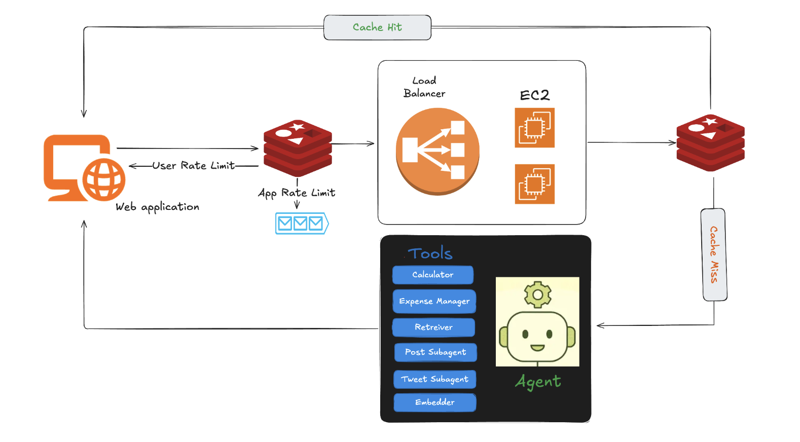
</p>

<p align="center">
  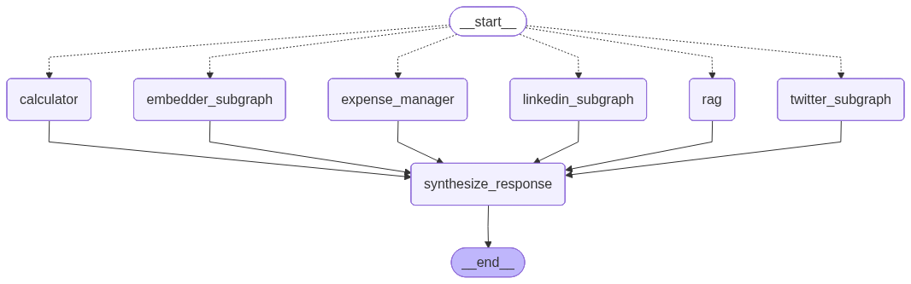
</p>

The system implements a **ReAct (Reasoning + Acting)** pattern where the agent iteratively reasons about user queries and selects appropriate tools until the task is complete.

### Key Components

| Component | Technology | Purpose |
|-----------|------------|---------|
| **Agent Orchestration** | LangGraph | State machine for multi-step reasoning |
| **Vector Store** | Qdrant Cloud | Semantic search with RBAC filtering |
| **Database** | PostgreSQL (RDS) | Conversation persistence, checkpointing |
| **Cache** | Redis (ElastiCache) | Semantic caching, rate limiting |
| **LLM** | GPT-4o-mini | Reasoning and generation |
| **Embeddings** | text-embedding-3-small | Document & query embeddings |
| **Reranking** | Cohere Rerank | Result relevance optimization |

---

## Features

### 1. Multi-Agent Tool System

The agent has access to **7 specialized tools**, each designed for specific tasks:

```
┌─────────────────────────────────────────────────────────────────┐
│                        AVAILABLE TOOLS                          │
├─────────────────┬───────────────────────────────────────────────┤
│ calculator      │ Safe math evaluation (sqrt, log, trig, etc.)  │
│ expense_manager │ Track expenses by category with CRUD ops      │
│ rag_retriever   │ Semantic search with visibility filtering     │
│ general_llm     │ General knowledge questions                   │
│ twitter_gen     │ Generate tweets with self-critique loop       │
│ linkedin_gen    │ Professional posts with outline generation    │
│ doc_embedder    │ Process PDFs/arXiv papers into knowledge base │
└─────────────────┴───────────────────────────────────────────────┘
```

---

### 2. Sub-Graphs for Complex Workflows

Each complex tool is implemented as a **sub-graph** with its own state machine, enabling sophisticated multi-step workflows.

#### Twitter Generation Sub-Graph

<table>
<tr>
<td width="50%" valign="top">

**Self-Critique Loop:**
- Generate draft tweet (max 280 chars)
- AI critic evaluates quality (1-10 score)
- Iterate until quality >= 8.0 or max 3 iterations
- Human approval via interrupt before posting

**Approval Loop:**

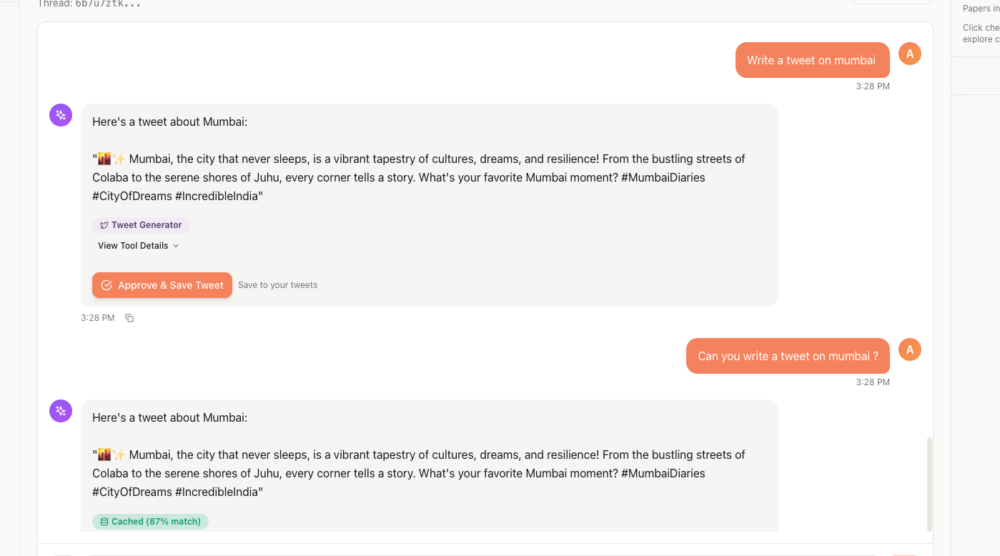

</td>
<td width="50%">
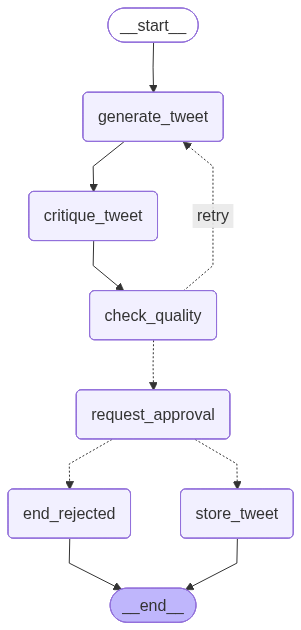
</td>
</tr>
</table>

#### LinkedIn Post Sub-Graph

<table>
<tr>
<td width="50%" valign="top">

**Two-Stage Generation:**
1. **Outline Creation:** Hook, main points, evidence, CTA
2. **Full Post Generation:** Expand outline with storytelling
3. **Quality Evaluation:** Iterate with self-critique
4. **Finalization:** Format for platform

**Human-in-the-Loop (HITL):**

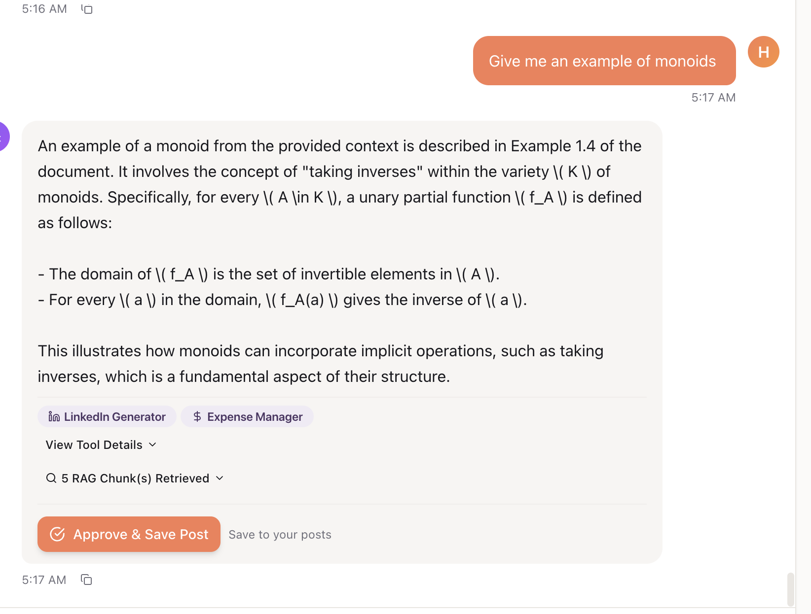

</td>
<td width="50%">
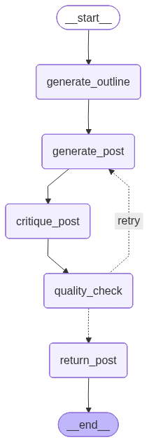
</td>
</tr>
</table>

#### Document Embedder Sub-Graph

<table>
<tr>
<td width="50%" valign="top">

**Processing Pipeline:**
1. arXiv detection and paper fetching
2. Duplicate check against existing documents
3. PDF chunking with parallel processing (8 workers)
4. Vector embedding and Qdrant storage
5. Blog post generation (parallel)[Not-Implemented]
6. S3 upload for web hosting[Not-Implemented]

</td>
<td width="50%">
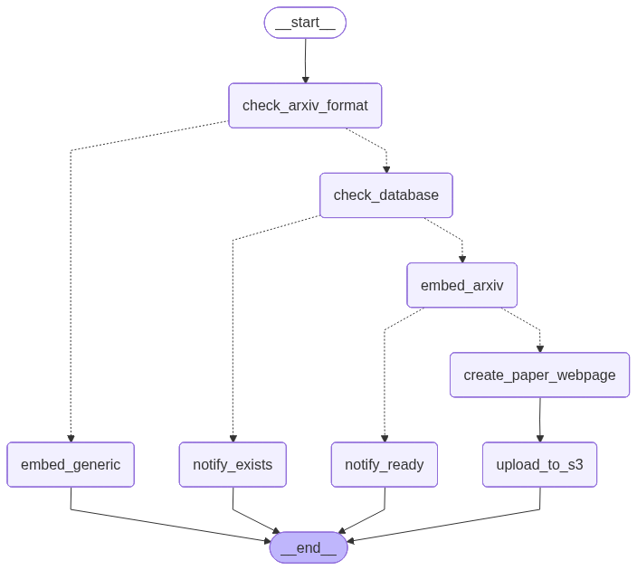
</td>
</tr>
</table>

---

### 3. Human-in-the-Loop (HITL)

The system uses LangGraph's `interrupt()` to pause execution at critical decision points:

```python
# Tweet approval interrupt
approval = interrupt({
    "type": "tweet_approval",
    "draft": state["draft"],
    "quality_score": state["quality_score"],
    "iterations": state["iteration_count"]
})
```

**How it works:**
1. Agent generates content and reaches approval checkpoint
2. Execution pauses, state persisted to PostgreSQL
3. User reviews content in frontend
4. On approval, `Command(resume={...})` continues execution
5. Content is finalized and returned

---

### 4. Semantic Caching (Tenant-Level)

The system implements intelligent caching that isolates data by tenant while using semantic similarity to serve cached responses for similar questions.

<table>
<tr>
<td width="50%" valign="top">

**User A asks a question:**

A user from tenant `hpiq` in the `physics` department asks about "human in the loop". The response is generated and cached with tenant context.

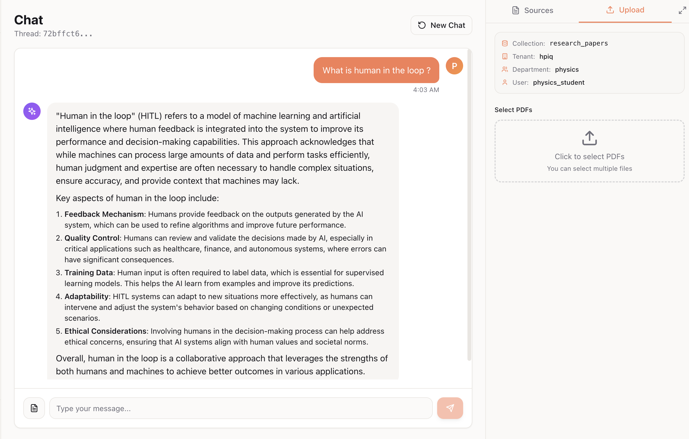

</td>
<td width="50%" valign="top">

**User B asks similar question:**

Another user from the **same tenant** asks a semantically similar question. The system finds a cached response with cosine similarity >= 0.75 and returns it instantly.

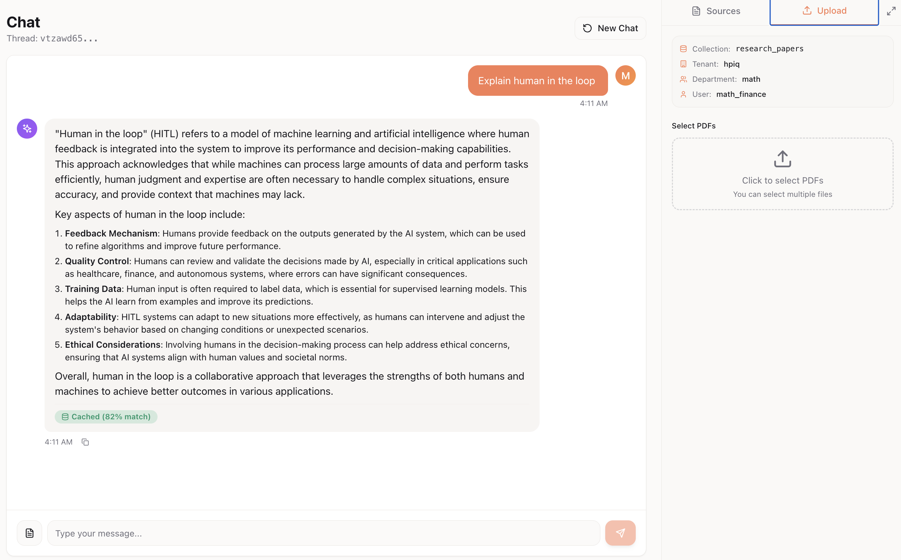

</td>
</tr>
</table>

<table>
<tr>
<td width="50%" valign="top">
<br>
<br>
<br>
<br>
<br>
<br>

**User C from DIFFERENT tenant asks same question:**

A user from tenant `together` (different from `hpiq`) asks the same question. Despite semantic similarity, the cache is **not used** because tenant IDs don't match. A fresh response is generated.

This ensures **data isolation** - tenants never see each other's cached responses.

</td>
<td width="50%">
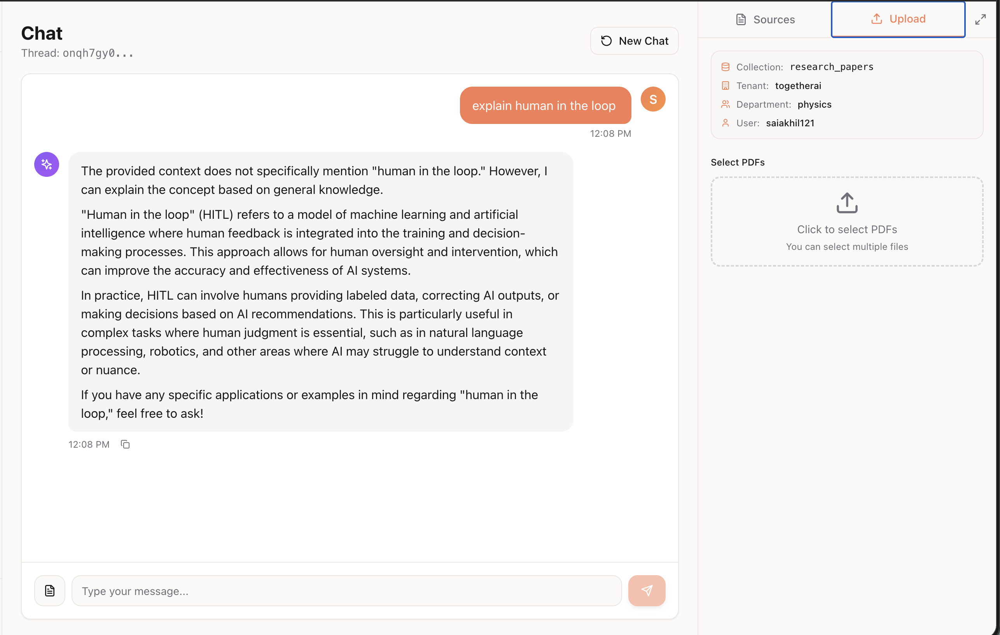
</td>
</tr>
</table>

<table>
<tr>
<td width="50%" valign="top">

**Two-Tier Cache Strategy:**

| Tier | Method | Threshold |
|------|--------|-----------|
| **Exact Match** | SHA-256 hash of query | 100% match |
| **Semantic Match** | Cosine similarity of embeddings | >= 0.75 |

**Intelligent Cache Rules:**
- RAG responses: Cache if tenant AND department match
- Non-RAG responses: Cache if tenant matches
- LRU eviction: Max 25 entries per tenant

</td>
<td width="50%" valign="top">

**Tenant Isolation:**
```
Cache Key: chat_cache:{tenant_id}:{question_hash}
Index Key: cache_embedding_index:{tenant_id}
```

Each tenant has isolated cache storage. Queries are only matched against cache entries from the same tenant, ensuring complete data privacy between organizations.

</td>
</tr>
</table>

---

### 5. Rate Limiting


<p align="center">
  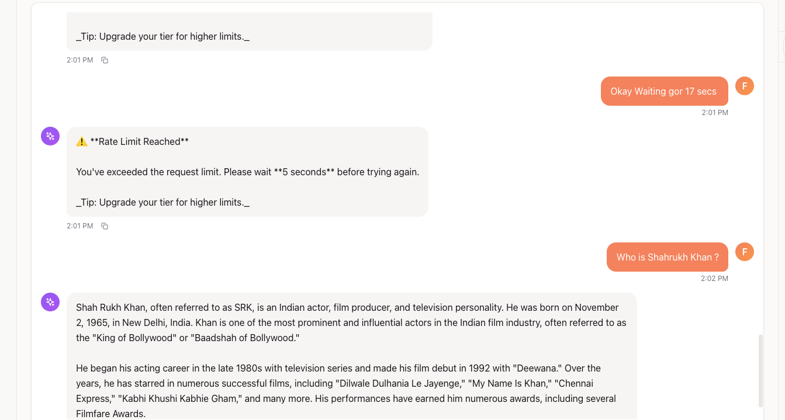
</p>

**User Tier System:**

| Tier | Requests/min | Tokens/min | Queue Priority |
|------|--------------|------------|----------------|
| `free` | 3 | 100 | Low |
| `power` | 30 | 20,000 | Medium |
| `super` | Unlimited | Unlimited | High |

**Implementation:**
- **Sliding Window Algorithm** with Redis
- **Global System Limit:** 400 requests/min
- **Fail-Closed Strategy:** Denies requests if Redis unavailable
- **Exponential Backoff:** 1s -> 2s -> 4s -> 8s -> 16s (capped at 30s)

---

### 6. Request Queuing

When system is at capacity, requests enter a Redis-backed queue:

```
┌─────────────────────────────────────────────────────────┐
│                    REQUEST QUEUE                        │
├─────────────────────────────────────────────────────────┤
│  Max Queue Size: 100 items                              │
│  Max Wait Time: 60 seconds                              │
│  Stale Cleanup: Automatic (client disconnects)          │
└─────────────────────────────────────────────────────────┘
```

**SSE Queue Updates:**
```json
{"event": "queue", "data": {"position": 3, "estimated_wait": "15s"}}
```

---

### 7. RBAC & Multi-Tenant Filtering

**Visibility Rules for RAG Retrieval:**

```python
def build_visibility_filter(tenant_id, department, user_id):
    """
    Users can see:
    - Public docs in their tenant + department
    - Their own private docs
    """
    return Filter(
        should=[
            # Public documents in same tenant/dept
            Filter(must=[
                FieldCondition(key="visibility", match="public"),
                FieldCondition(key="tenant_id", match=tenant_id),
                FieldCondition(key="department", match=department),
            ]),
            # User's own private documents
            Filter(must=[
                FieldCondition(key="visibility", match="private"),
                FieldCondition(key="uploaded_by_user_id", match=user_id),
            ]),
        ]
    )
```

---

### 8. Memory & State Management

**PostgreSQL Checkpointing:**
- Conversation history persists across server restarts
- Thread-based state isolation
- LangGraph's `PostgresSaver` for reliable checkpoints

**Context Variables (Thread-Safe):**
```python
current_thread_id = contextvars.ContextVar("thread_id")
current_user_id = contextvars.ContextVar("user_id")
current_tenant_id = contextvars.ContextVar("tenant_id")
current_department = contextvars.ContextVar("department")
```

**Recursion & Loop Limits:**

| Limit | Value | Purpose |
|-------|-------|---------|
| Agent Timeout | 120 seconds | Prevent runaway executions |
| Tweet Iterations | 3 max | Self-critique loop cap |
| LinkedIn Iterations | 3 max | Quality refinement cap |
| Queue Wait | 60 seconds | Request timeout |

---

### 9. Observability with LangSmith

<table>
<tr>
<td width="50%">
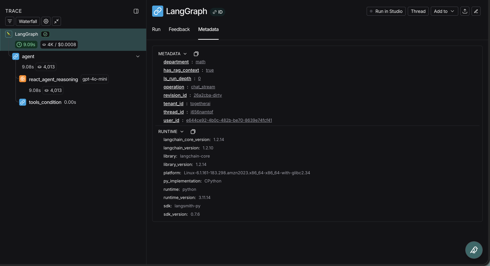
</td>
<td width="50%">
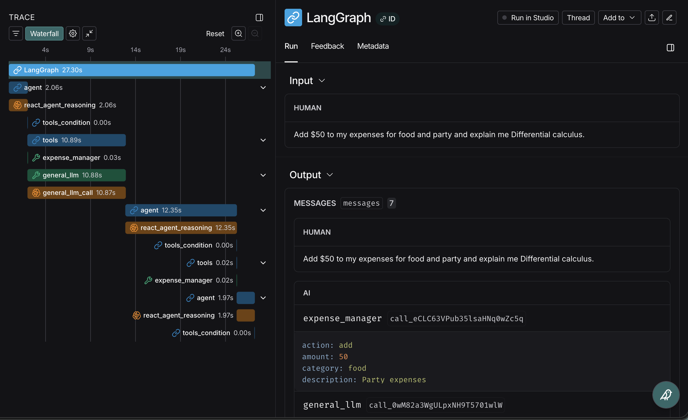
</td>
</tr>
</table>

**Tracing Configuration:**
- Every LLM call tagged with `run_name` for easy filtering
- Metadata includes: `user_id`, `tenant_id`, `thread_id`, `department`
- Tags: `tenant:{id}`, `user:{id}`, `rag:true/false`, `streaming:true`

**Traced Operations:**
- `react_agent_reasoning` - Main agent decisions
- `twitter_draft_generation` / `twitter_critique`
- `linkedin_outline_generation` / `linkedin_post_generation`
- `rag_retrieval` - Document search queries

---

## Deployment

**AWS Services:**
- **EC2:** Compute-optimized instances for parallel PDF processing
- **RDS PostgreSQL:** Multi-AZ for conversation persistence
- **ElastiCache Redis:** Caching and rate limiting
- **ALB:** HTTPS termination with 300s timeout for SSE streaming
- **ACM:** SSL certificate management

---

## Tech Stack

```
Backend:
├── FastAPI (async API framework)
├── LangGraph (agent orchestration)
├── LangChain (LLM integrations)
├── PostgreSQL  (persistence)
├── Redis (caching, rate limiting)
├── Qdrant (vector search)
├── Cohere (reranking)
└── Unstructured (PDF processing)

Frontend:
├── React
├── TypeScript
└── Vite

Infrastructure:
├── AWS (EC2, RDS, ElastiCache, ALB, S3)
├── nginx (reverse proxy)
├── systemd (service management)
└── LangSmith (observability)
```

---

## API Endpoints

| Endpoint | Method | Description |
|----------|--------|-------------|
| `/api/chat/stream` | POST | SSE streaming chat with agent |
| `/api/chat/stream-with-file` | POST | Chat with PDF upload |
| `/api/chat/approve/{thread_id}` | POST | HITL approval endpoint |
| `/api/chat/history/{thread_id}` | GET | Retrieve conversation |
| `/api/documents/upload` | POST | Upload to knowledge base |
| `/health` | GET | Service health check |

---

## Local Hosting

### Prerequisites

- Python 3.11+
- Node.js 20+
- PostgreSQL 16+
- Redis 7+

### Setup

```bash
# Clone and setup
git clone https://github.com/alliedbrother/paper_explainer_agentic_rag.git
cd paper_explainer_agentic_rag/final_app

# Python environment
python -m venv venv
source venv/bin/activate
pip install -r requirements.txt

# Environment variables
cp .env.example .env
# Edit .env with your API keys

# Start services (Docker)
docker run -d --name postgres -p 5432:5432 -e POSTGRES_PASSWORD=password postgres:16
docker run -d --name redis -p 6379:6379 redis:7

# Run backend
uvicorn main:app --reload

# Run frontend (new terminal)
cd frontend && npm install && npm run dev
```

Open http://localhost:5173

---

## Performance Characteristics

| Metric | Value |
|--------|-------|
| Parallel PDF Workers | 8 (large) / 4 (medium) |
| Embedding Model | text-embedding-3-small |
| Vector Dimensions | 1536 |
| Cache Hit Ratio | ~40% (semantic matching) |
| Avg Response Time | < 2s (cached) / 5-10s (RAG) |
| Concurrent Users | ~50-100 per instance |
